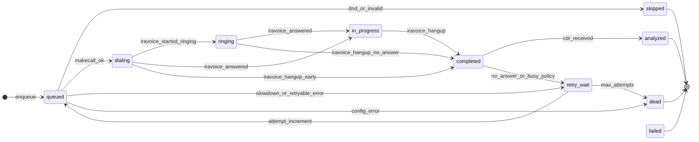

# Call state machine

**Authority for Flock (origination) and Ledger (webhook ingest) in Phase 1.**

States match the `call_state` enum on `call_ledger` ([`db/migrations/000001_init.up.sql`](../db/migrations/000001_init.up.sql)). IraVoice webhook field names are reconciled against [`reference/iravoice-ld-api.md`](reference/iravoice-ld-api.md) and [`contracts/epicode/iravoice-webhook-event.schema.json`](../contracts/epicode/iravoice-webhook-event.schema.json) (`event_name`, `event_data.timestamp`, `event_data.call_uuid`, `event_data.call_params`).

Internal transition messages: [`contracts/call-state-change.schema.json`](../contracts/call-state-change.schema.json).

---

## States overview

| State | Meaning | Typical entry |
|-------|---------|---------------|
| `queued` | Contact eligible; dial job not yet handed to IraVoice | Campaign launcher enqueues |
| `dialing` | makecall accepted; media leg starting | `iravoice::started` |
| `ringing` | Remote party ringing | `iravoice::ringing` |
| `in_progress` | Call answered; bot/media active | `iravoice::answered` |
| `completed` | Call ended (hangup received); awaiting CDR | `iravoice::hangup` |
| `analyzed` | CDR stored and enrichment done | CDR webhook received |
| `retry_wait` | Backoff before re-queue (transient failure or no-answer/busy policy) | Flock or Ledger |
| `failed` | Attempt failed without a scheduled retry | Policy / hard error |
| `skipped` | Not dialed (DND, invalid number, scrub) | Flock pre-dial |
| `dead` | Exhausted retries or permanent config error | Flock / Ledger |

---

## Transition table

| From | Trigger / condition | To | Side effects |
|------|---------------------|-----|--------------|
| — | Campaign launcher creates row | `queued` | Set `dedupe_key`, `attempt`, `queued_at`; stamp `call_params` with `campaign_id` / `contact_id` at makecall time |
| `queued` | Flock picks job; `contacts.dnd_flag = true` | `skipped` | Set `outcome`; no makecall |
| `queued` | Flock pre-dial validation fails (invalid E.164, missing bot) | `skipped` | Set `error_reason`, `outcome` |
| `queued` | Flock POST makecall; `status_code = 0`, `call_uuid` returned | `dialing` | Set `call_uuid`, `cluster`, `dialed_at`; emit internal dial-job consumed |
| `queued` | Flock POST makecall; `slowdown = true` | `retry_wait` | Flock pauses originator **60s**; leave row `queued` or move to `retry_wait` per implementation — **do not** spam makecall |
| `queued` | Flock POST makecall; `status_code ≠ 0`; HTTP 500/503 | `retry_wait` | Set `error_reason` from response; schedule backoff |
| `queued` | Flock POST makecall; `status_code ≠ 0`; HTTP 400/404/422 | `dead` | Config/payload error — alert, no blind retry |
| `queued` | Flock POST makecall; HTTP 403 (out of window / cluster down) | `retry_wait` | Retry in calling window |
| `queued` | Flock POST makecall; HTTP 409 (no trunks) | `dead` | Provisioning alert |
| `dialing` | Webhook `iravoice::started` | `dialing` | Idempotent; set `dialed_at` if unset; store raw event |
| `dialing` | Webhook `iravoice::ringing` | `ringing` | Store raw event |
| `ringing` | Webhook `iravoice::answered` | `in_progress` | Set `answered_at`; store raw event |
| `dialing` | Webhook `iravoice::answered` (no ringing seen) | `in_progress` | Set `answered_at` — tolerate out-of-order delivery |
| `in_progress` | Webhook `iravoice::hangup` | `completed` | Set `ended_at`, `outcome` from hangup extras if present; store raw event |
| `ringing` | Webhook `iravoice::hangup` (no answer) | `completed` | Set `ended_at`; classify no-answer → see retry row below |
| `dialing` | Webhook `iravoice::hangup` (early fail) | `completed` | Set `ended_at`; classify busy/fail from extras |
| `completed` | CDR POST (BotCompose shape: `call_info` / metrics) | `analyzed` | Insert `cdrs` row; copy metrics; link `call_uuid` |
| `completed` | Hangup classified no-answer or busy; retries remain | `retry_wait` | Set `outcome`; schedule per campaign policy |
| `retry_wait` | Backoff elapsed; `attempt < max_attempts` | `queued` | Increment `attempt`; new `dedupe_key` |
| `retry_wait` | Backoff elapsed; `attempt >= max_attempts` | `dead` | Set `outcome` |
| `*` | Operator `dropcall(call_uuid)` while in flight | `completed` → `analyzed` | Same hangup + CDR path when events arrive |
| `*` | Campaign stopped | `dead` or `skipped` | Phase 1 policy TBD for in-flight legs |

---

## IraVoice webhook → state mapping

Only these `event_name` values **transition** `call_ledger.state`. All others are **telemetry** (log raw JSON, no state change).

| `event_name` | `to_state` | Timestamp field | Notes |
|--------------|------------|-----------------|-------|
| `iravoice::started` | `dialing` | `event_data.timestamp` | May arrive after makecall success already set `dialing` |
| `iravoice::ringing` | `ringing` | `event_data.timestamp` | |
| `iravoice::answered` | `in_progress` | `event_data.timestamp` | Record `answered_at` |
| `iravoice::hangup` | `completed` | `event_data.timestamp` | Record `ended_at`; await CDR |
| `iravoice::stream_stopped` | — | `event_data.timestamp` | Log only (near hangup); optional audit in `call-state-change.source_event` |

**Telemetry (no transition):** `iravoice::speech`, `iravoice::silent`, `iravoice::play_paused`, `iravoice::play_stopped`, `iravoice::play_done`, `iravoice::dtmf`, `iravoice::botaudio_stream_started`, `iravoice::call_quality`.

Resolve `campaign_id` / `contact_id` from `event_data.call_params` (Starling-stamped at makecall) or lookup by `event_data.call_uuid` on `call_ledger`.

---

## makecall response (Flock, before webhooks)

| Condition | Next state | Flock action |
|-----------|------------|--------------|
| `status_code = 0`, `call_uuid` present | `dialing` | Persist `call_uuid`, `cluster` |
| `slowdown = true` | stay `queued` or `retry_wait` | **Pause 60s** before next makecall |
| `status_code ≠ 0` + retryable HTTP | `retry_wait` | Backoff |
| `status_code ≠ 0` + config HTTP (400, 404, 422) | `dead` | Alert |
| HTTP 409 | `dead` | Alert provisioning |

---

## Post-hangup classification (retry policy)

After `iravoice::hangup` → `completed`, Ledger classifies using hangup/CDR extras (exact field names **TODO** — capture from smoke-test payloads):

| Outcome (conceptual) | Next | Notes |
|----------------------|------|-------|
| Normal end | await CDR → `analyzed` | |
| No answer | `retry_wait` → `queued` (`attempt++`) | If under max attempts |
| Busy | `retry_wait` → `queued` (`attempt++`) | If under max attempts |
| Invalid / rejected | `dead` or `skipped` | No retry |
| CPA drop (FX/AM per `drop_on_cpa_events`) | `completed` → CDR → `analyzed` | May short-call; outcome from CDR |

---

## CDR → analyzed

When Ledger receives a BotCompose CDR at the same `event_url`:

1. Match `call_uuid` to `call_ledger`
2. Insert `cdrs` (`raw_json`, duration, token/latency fields when present)
3. Transition `completed` → `analyzed`
4. Emit [`cdr-received`](../contracts/cdr-received.schema.json) internally

**TODO:** Confirm CDR `call_uuid` path and hangup reason fields from first live capture ([`docs/epicode-env.md`](epicode-env.md) OPEN ITEMS).

---

## State diagram

---

## Correlation & idempotency

- **Join key:** `call_uuid` (from makecall response and every webhook `event_data.call_uuid`)
- **Dedupe:** `dedupe_key` = `{campaign_id}:{contact_id}:{attempt}` — Redis SETNX in Flock before makecall
- **Idempotent webhooks:** Duplicate `iravoice::ringing` / `iravoice::answered` with same `call_uuid` must not regress state (ignore or no-op if `to_state` already reached)

---

## Implementation notes (Phase 1)

- Ledger owns webhook parsing and `call-state-change` emission; Flock owns makecall and pre-dial scrubbing.
- Do **not** subscribe to NATS — all events arrive via HTTP POST to `event_url`.
- Store full raw webhook body on every event ( `event_data.additionalProperties: true` ).

---

## Reconciled vs TODO

| Item | Status |
|------|--------|
| `event_name` enum (`iravoice::…`) | Reconciled — LD API 2.0.0 |
| `event_data.timestamp`, `call_uuid`, `call_params` | Reconciled |
| Hangup reason / SIP cause field names on `iravoice::hangup` | **TODO** — empiric from smoke test |
| CDR field paths for no-answer / busy classification | **TODO** — empiric from smoke test |
| Max attempts / retry intervals | **TODO** — campaign `pacing` jsonb policy (Phase 1) |
